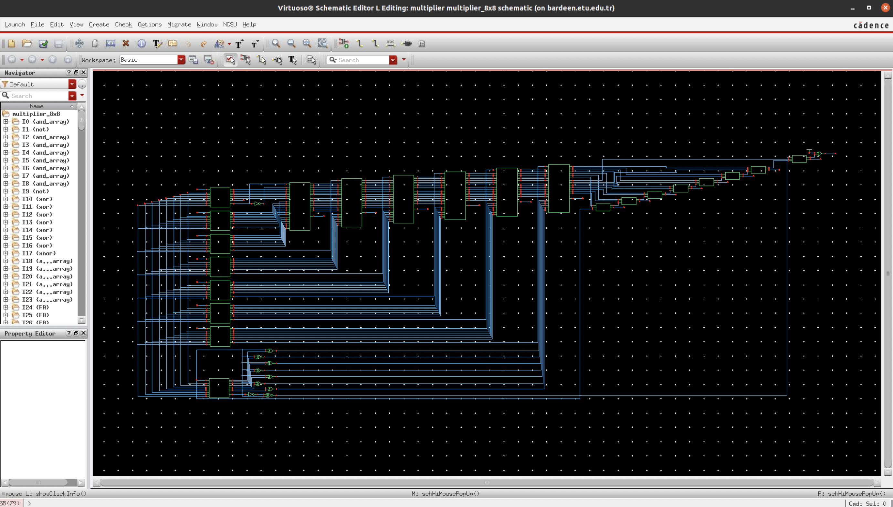
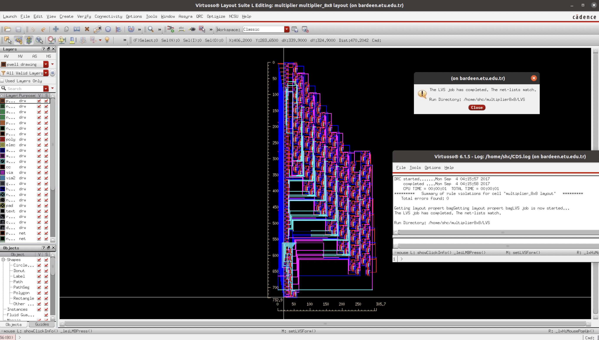

# wallace-multiplier-cmos-vlsi
8bit x 8bit Signed Wallace Tree Multiplier 600nm CMOS VLSI Design (verilog + schematic + layout)

Designed in Cadence Virtuoso using open source [NCSU CDK](https://eda.ncsu.edu/ncsu-cdk) 600nm (ami06) process.

Used gate level [rtl code](https://github.com/celuk/Design-of-various-multiplier-Array-Booth-Wallace-/blob/master/Wallace%20Tree%20Multiplier/Wallace%20Tree%20multiplier.v) borrowed and modified (modularized for easy layout) from [Design-of-various-multiplier-Array-Booth-Wallace-](https://github.com/pareddy113/Design-of-various-multiplier-Array-Booth-Wallace-/blob/master/Wallace%20Tree%20Multiplier/Wallace%20Tree%20multiplier.v) repository.

The project is described detailed in the report. (in Turkish)

For using project in Cadence Virtuoso:

```bash
cd cadence-project

virtuoso
```

Various screenshots -from gates to multiplier schematic and layouts- can be found in [scrs](scrs) directory.




